# Zero-Trust Architecture Diagrams

This document contains visual diagrams explaining the Istio Ambient Mode architecture, ztunnel operation, HBONE tunneling, and policy enforcement for the autonomous code review system.

## Diagram Summary

| # | Diagram Name | Purpose |
|---|--------------|---------|
| 1 | High-Level System Architecture | Overall system with all components |
| 2 | Ztunnel Architecture | How ztunnel operates on a node |
| 3 | HBONE Tunnel | HTTP/2 CONNECT tunnel between nodes |
| 4 | Traffic Flow with Policies | Complete request flow with decisions |
| 5 | Default Deny Policy | Effect of global deny-all |
| 6 | Orchestrator Policies | Hub-and-spoke communication pattern |
| 7 | External API Policies | Egress control to external services |
| 8 | Complete Policy Matrix | All allowed/blocked paths |
| 9 | mTLS Certificate Flow | Certificate issuance and rotation |
| 10 | SPIFFE Authorization | Identity extraction and matching |
| 11 | ServiceEntry + AuthZ | Why both are needed |
| 12 | Real Traffic Example | PR Agent → OpenAI (success) |
| 13 | Policy Violation Example | PR Agent → Anthropic (blocked) |

---

## Color Legend

Throughout these diagrams, consistent colors are used:

- 🟦 **Blue** - Control plane components (Istiod, CA)
- 🟧 **Orange** - Data plane components (Ztunnel)
- 🟪 **Purple** - Application agents
- 🟩 **Green** - External services / Allowed connections
- 🟥 **Red** - Blocked/denied connections
- 🟨 **Yellow** - Policy decision points

---

## Diagram 1: High-Level System Architecture

**Description:** This diagram shows the complete system architecture with Istio control plane (istiod + CA), ztunnel instances on each node, agent deployments, and external service connections.

---

## Diagram 2: Ztunnel Architecture and Responsibilities

**Description:** Shows how ztunnel operates as a node-level proxy, intercepting traffic via TPROXY, enforcing policies, and handling mTLS for multiple workloads on the same node.

---

## Diagram 3: HBONE (HTTP-Based Overlay Network) Tunnel

**Description:** Sequence diagram showing how HBONE creates an mTLS tunnel between ztunnels using HTTP/2 CONNECT, making cross-node communication secure and transparent.

---

## Diagram 4: Traffic Flow with Policy Enforcement

**Description:** Flowchart showing complete traffic flow from source to destination with policy enforcement at both egress (source) and ingress (destination) points.

---

## Diagram 5: Default Deny Policy (Policy 1)

```mermaid
graph TB
    subgraph "Before Default Deny Policy"
        subgraph "Namespace: agensys-demo-1"
            A1[PR Agent]
            A2[Summary Agent]
            A3[MCP Scanning]
            A4[GitHub MCP]
            A5[Orchestrator]
        end
        
        A1 -.->|✅ Allowed| A2
        A1 -.->|✅ Allowed| A3
        A2 -.->|✅ Allowed| A4
        A3 -.->|✅ Allowed| A5
        A4 -.->|✅ Allowed| A1
        
        NOTE1[All traffic allowed by default<br/>No security enforcement]
    end

    POLICY[Apply Default Deny Policy:<br/>01-default-deny.yaml<br/>spec: emptyLeft]

    subgraph "After Default Deny Policy"
        subgraph "Namespace: agensys-demo-1"
            B1[PR Agent]
            B2[Summary Agent]
            B3[MCP Scanning]
            B4[GitHub MCP]
            B5[Orchestrator]
        end
        
        B1 -.->|❌ BLOCKED| B2
        B1 -.->|❌ BLOCKED| B3
        B2 -.->|❌ BLOCKED| B4
        B3 -.->|❌ BLOCKED| B5
        B4 -.->|❌ BLOCKED| B1
        
        NOTE2[All traffic DENIED<br/>Explicit allows required]
    end

    NOTE1 --> POLICY
    POLICY --> NOTE2

    classDef allowed fill:#c8e6c9,stroke:#2e7d32,stroke-width:2px,color:#000
    classDef denied fill:#ffcdd2,stroke:#c62828,stroke-width:2px,color:#000
    classDef policy fill:#fff9c4,stroke:#f57f17,stroke-width:3px,color:#000

    class A1,A2,A3,A4,A5 allowed
    class B1,B2,B3,B4,B5 denied
    class POLICY policy
```

**Description:** Shows the effect of the default-deny policy, transforming from "allow all" to "deny all" mode, requiring explicit allow policies for any communication.

---

## Diagram 6: Orchestrator Policies (Policy 2)

```mermaid
graph TB
    subgraph "Policy: 02-orchestrator-policies.yaml"
        subgraph "Namespace: agensys-demo-1"
            ORCH[Orchestrator Agent<br/>SPIFFE: .../sa/orchestrator-agent]
            
            PRA[PR Agent<br/>Port 8080<br/>Methods: POST]
            MCP_SCAN[MCP Scanning<br/>Port 3000]
            SUM[Summary Agent<br/>Port 8080<br/>Methods: POST]
            MCP_GH[GitHub MCP<br/>Port 3000]
        end
    end

    ORCH ==>|✅ ALLOW<br/>Policy 2a<br/>POST :8080| PRA
    ORCH ==>|✅ ALLOW<br/>Policy 2b<br/>:3000| MCP_SCAN
    ORCH ==>|✅ ALLOW<br/>Policy 2c<br/>POST :8080| SUM
    ORCH ==>|✅ ALLOW<br/>Policy 2d<br/>:3000| MCP_GH

    PRA -.->|❌ BLOCKED<br/>No policy| SUM
    PRA -.->|❌ BLOCKED<br/>No policy| MCP_SCAN
    SUM -.->|❌ BLOCKED<br/>No policy| MCP_GH
    MCP_SCAN -.->|❌ BLOCKED<br/>No policy| PRA

    NOTE[Only Orchestrator can<br/>communicate with agents<br/>All other inter-agent<br/>communication blocked]

    classDef orchestrator fill:#e1bee7,stroke:#4a148c,stroke-width:3px,color:#000
    classDef allowed fill:#c8e6c9,stroke:#2e7d32,stroke-width:2px,color:#000
    classDef blocked fill:#ffcdd2,stroke:#c62828,stroke-width:1px,stroke-dasharray: 5 5,color:#000

    class ORCH orchestrator
    class PRA,MCP_SCAN,SUM,MCP_GH allowed
```

**Description:** Shows how Orchestrator policies create a hub-and-spoke pattern where only the Orchestrator can communicate with agents, preventing lateral movement.

---

## Diagram 7: External API Policies (Policies 3-6)

**Description:** Illustrates egress policies where each agent/MCP server can only access its designated external service, enforced via ServiceEntry + AuthorizationPolicy combination.

---

## Diagram 8: Complete Policy Enforcement Matrix

```mermaid
graph TB
    subgraph "Complete Zero-Trust Policy Matrix"
        subgraph "Internal Communication"
            ORCH2[Orchestrator]
            
            subgraph "Agents & MCP Servers"
                PRA2[PR Agent]
                SUM2[Summary Agent]
                MCP_SCAN2[MCP Scanning]
                MCP_GH2[GitHub MCP]
            end
        end

        subgraph "External APIs"
            OPENAI2[OpenAI]
            ANTHROPIC2[Anthropic]
            SEMGREP2[Semgrep]
            GHAPI2[GitHub API]
        end
    end

    %% Orchestrator to internal services (ALLOWED)
    ORCH2 ==>|✅ POST :8080| PRA2
    ORCH2 ==>|✅ :3000| MCP_SCAN2
    ORCH2 ==>|✅ POST :8080| SUM2
    ORCH2 ==>|✅ :3000| MCP_GH2

    %% Agents to external APIs (ALLOWED)
    PRA2 ==>|✅ :443| OPENAI2
    SUM2 ==>|✅ :443| ANTHROPIC2
    MCP_SCAN2 ==>|✅ :443| SEMGREP2
    MCP_GH2 ==>|✅ :443| GHAPI2

    %% Inter-agent (BLOCKED)
    PRA2 -.->|❌| SUM2
    PRA2 -.->|❌| MCP_SCAN2
    SUM2 -.->|❌| PRA2
    SUM2 -.->|❌| MCP_GH2

    %% Wrong external API (BLOCKED)
    PRA2 -.->|❌| ANTHROPIC2
    SUM2 -.->|❌| OPENAI2
    MCP_SCAN2 -.->|❌| GHAPI2
    MCP_GH2 -.->|❌| SEMGREP2

    %% Default deny everything else
    PRA2 -.->|❌ Default Deny| INTERNET[Any Other<br/>Internet Host]
    SUM2 -.->|❌ Default Deny| INTERNET

    classDef orchestrator fill:#e1bee7,stroke:#4a148c,stroke-width:3px,color:#000
    classDef agent fill:#f3e5f5,stroke:#6a1b9a,stroke-width:2px,color:#000
    classDef external fill:#e8f5e9,stroke:#1b5e20,stroke-width:2px,color:#000
    classDef denied fill:#ffebee,stroke:#c62828,stroke-width:2px,color:#000

    class ORCH2 orchestrator
    class PRA2,SUM2,MCP_SCAN2,MCP_GH2 agent
    class OPENAI2,ANTHROPIC2,SEMGREP2,GHAPI2 external
    class INTERNET denied
```

**Description:** Complete matrix showing all allowed paths (solid green lines) and blocked paths (dashed red lines), demonstrating the comprehensive Zero-Trust security model.

---

## Diagram 9: mTLS Certificate Flow

**Description:** Shows the complete certificate lifecycle from pod creation to mTLS usage, including CSR, issuance, storage, and automatic rotation.

---

## Diagram 10: SPIFFE ID-Based Authorization

**Description:** Detailed flowchart showing how ztunnel extracts SPIFFE IDs from mTLS certificates and uses them for identity-based authorization decisions.

---

## Diagram 11: ServiceEntry + AuthorizationPolicy for External APIs

**Description:** Shows why both ServiceEntry (makes host visible) and AuthorizationPolicy (grants access) are required for external API access.

---

## Diagram 12: Real-World Traffic Example - PR Agent to OpenAI

**Description:** Real-world example showing complete traffic flow from application code through TPROXY, ztunnel, HBONE tunnel, policy checks, to external API and back.

---

## Diagram 13: Policy Violation Example - PR Agent to Anthropic (Blocked)

**Description:** Shows what happens when a policy violation occurs - the connection is silently dropped, logged, and monitored, resulting in a timeout for the application.

---
